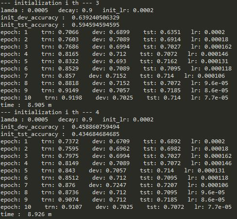

# SemEval-2018-task12
This repository contains GIST team system code for SemEval 2018 task 12: Argument Reasoning Comprehension
The paper for task description is checked at [The Argument Reasoning Comprehension Task: Identification and Reconstruction of Implicit Warrants] (https://arxiv.org/pdf/1708.01425.pdf) by Habernal et al. (2018).
The official result is checked at [here] (https://github.com/habernal/semeval2018-task12-results)
Our paper is GIST at SemEval-2018 Task 12: A network transferring inference knowledge to Argument Reasoning Comprehension task

